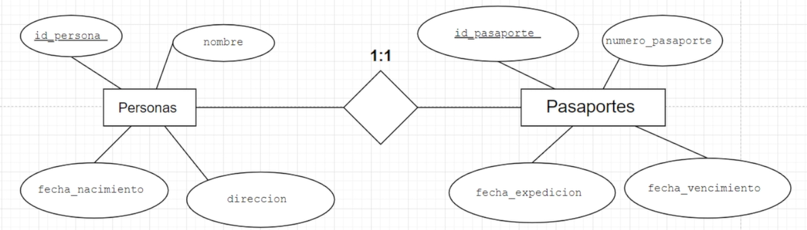
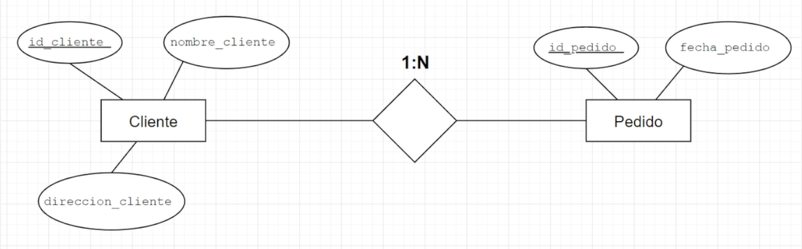
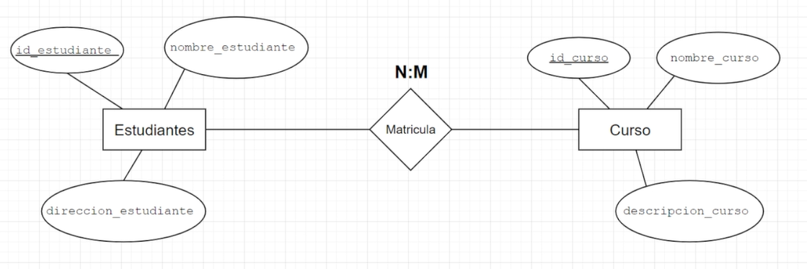

# Entidad Relacion de Tablas
En este modulo te voy a enseñar a como hacer una union (o hacer referencias) de tablas, para que de esta manera Podamos unir mas de dos tablas, aprenderas `uno a muchos`, `muchos a muchos` y `uno a uno`.

## Relacion de UNO a UNO

En este tipo de relaciones, la forma de como unir dos tablas es por medio de una referencia, la cual puede estar en la `Tabla A` o en la `Tabla B`.



### Primer Caso

```sql
create table personas(
    id_persona serial primary key,
    nombre varchar(50),
    fecha_nacimiento DATE,
    direccion varchar(100)
);
```
```sql
create table pasaporte(
    id_pasaporte serial primary key,
    numero_pasaporte varchar(50),
    fecha_expediccion DATE,
    fecha_vencimiento DATE,
    id_persona int unique,
    foreign key (id_persona) references personas (id_persona)
);
```

### Segundo Caso

```sql
create table personas(
    id_persona serial primary key,
    nombre varchar(50),
    fecha_nacimiento DATE,
    direccion varchar(100),
    id_pasaporte int unique,
    foreign key (id_pasaporte) references pasaporte (id_pasaporte)
);
```
```sql
create table pasaporte(
    id_pasaporte serial primary key,
    numero_pasaporte varchar(50),
    fecha_expediccion DATE,
    fecha_vencimiento DATE
);
```

## Relacion de UNO a MUCHOS

En este tipo de relaciones, la forma de como unir dos tablas es por medio de una referencia, la cual puede estara en la `Tabla A` o `Tabla B`, dependiendo de la cardinalidad.




```sql
create table Cliente(
    id_cliente serial primary key,
    nombre_cliente varchar(50),
    direccion_cliente varchar(100)
);
```
```sql
create table Pedido(
    id_pedido serial primary key,
    fecha_pedido DATE,
    id_cliente int unique,
    foreign key (id_cliente) references Cliente (id_cliente)
);
```


## Relacion de MUCHOS a MUCHOS

En este tipo de relaciones, la forma de como unir dos tablas es por medio de una nueva `Tabla C`, esta se encargara de unir la `Tabla A` y la `Tabla B` por medio de referencias.




```sql
create table Estudiante(
    id_estudiante serial primary key,
    nombre_estudiante varchar(50),
    direccion_estudiante varchar(100)
);
```
```sql
create table Curso(
    id_curso serial primary key,
    nombre_curso varchar(50),
    descripcion_curso varchar(100),
);
```
```sql
create table Matricula(
    id_matricula serial primary key,
    id_estudiante int unique,
    id_curso int unique,
    foreign key (id_estudiante) references Estudiante (id_estudiante),
    foreign key (id_curso) references Curso (id_curso)
);
```