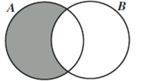
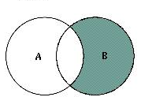
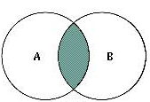
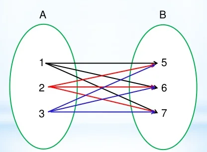

# Seleccion Multiple 
En este modulo vamos aprender a usar el `inner join`, esta palabra clave nos va ayudar a unir tablas y a selecionar valores de la derecha, izquierda y unidon de tablas.

## Ejemplos Base
Vamos a tener una tabla fija, donde vamos a trabajar con estos valores

```sql
create table Tabla_B(
    id_b serial primary key,
    nombre varchar(50),
    apellido varchar(50),
    edad integer
);
```

```sql
create table Tabla_A(
    id_a serial primary key,
    nombre varchar(50),
    apellido varchar(50),
    edad integer,
    union_id_b integer references Tabla_B(id_b)
);
```


## Union por la Izquierda

Aqui vamos a unir una `Tabla A` y una `Tabla B`, lo cual solo vamos a selecionar los valores de la `Tabla A`, solo los valores de la Izquierda



```sql
select * from Tabla_A a left join Tabla_B b on a.union_id_b = b.id_b; 
``` 

## Union por la Derecha

Aqui vamos a unir una `Tabla A` y una `Tabla B`, lo cual solo vamos a selecionar los valores de la `Tabla B`, solo los valores de la Derecha




```sql
select * from Tabla_A a right join Tabla_B b on a.union_id_b = b.id_b; 
``` 
## Interseccion
Aqui vamos a unir una `Tabla A` y una `Tabla B`, lo cual solo vamos a selecionar los valores de la Interseccion de las dos Tablas



```sql
select * from Tabla_A a inner join Tabla_B b on a.union_id_b = b.id_b; 
``` 

## Union Cartesiana
Aqui vamos a unir una `Tabla A` y una `Tabla B` de forma Cartesiana



```sql
select a.nombre, b(*) from Tabla_A a cross join Tabla_B b;
``` 

## Agrupamiento
- Agrupando los registros por el campo ``que nostros definimos`. Como resultado aparecen los nombres y la cantidad de registros para cada valor del campo.

    - Son un solo valor

    ```sql
    select nombre, count(*) from nombre group by nombre;
    ``` 

    - Con mas de un valor

    ```sql
    select nombre, edad, count(*) from nombre group by nombre, edad;
    ``` 

    - Con dos valores distintos

    ```sql
     select nombre, count(edad) from nombre group by nombre;
    ``` 
